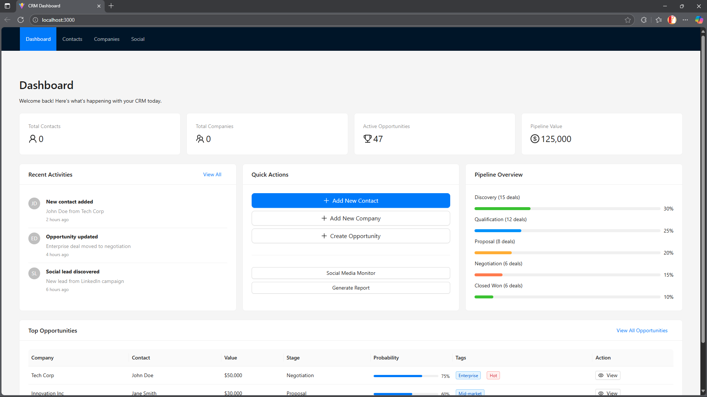

# 🚀 CRM Consulting Platform

A comprehensive Customer Relationship Management system with social media integration, designed for modern consulting businesses to discover, track, and convert leads effectively.



## 📋 Table of Contents

- [Features](#-features)
- [Tech Stack](#-tech-stack)
- [Quick Start](#-quick-start)
- [Login Credentials](#-login-credentials)
- [API Documentation](#-api-documentation)
- [Project Structure](#-project-structure)
- [Development](#-development)
- [Contributing](#-contributing)

## ✨ Features

### 🎯 **Core CRM Features**
- **Contact Management** - Complete CRUD operations with advanced search and filtering
- **Company Management** - Hierarchical company data with industry tracking
- **Opportunity Pipeline** - Sales pipeline with drag-drop Kanban interface
- **Activity Tracking** - Comprehensive interaction logging and follow-ups

### 📱 **Social Media Integration**
- **Lead Discovery** - Automated social media monitoring and lead identification
- **Social Profiles** - LinkedIn, Twitter, and other platform integration
- **Lead Scoring** - AI-powered lead qualification and prioritization
- **Real-time Feeds** - Live social media activity monitoring

### 📊 **Analytics & Reporting**
- **Dashboard Overview** - Key metrics and performance indicators
- **Conversion Tracking** - Pipeline analytics and conversion rates
- **Team Performance** - User activity and productivity metrics
- **Export Capabilities** - Data export in multiple formats

### 🔐 **Security & Authentication**
- **JWT Authentication** - Secure token-based authentication
- **Role-based Access** - Admin, Manager, Sales Rep, and Analyst roles
- **Session Management** - Secure session handling with refresh tokens
- **Data Encryption** - Password hashing and secure data storage

## 🛠 Tech Stack

### **Backend**
- **Node.js** + **Express.js** - REST API server
- **PostgreSQL** - Primary database with JSONB support
- **Sequelize ORM** - Database modeling and migrations
- **JWT** - Authentication and authorization
- **Docker** - Containerized database deployment

### **Frontend**
- **React 18** - Modern UI library with hooks
- **Vite** - Fast build tool and dev server
- **Redux Toolkit** - State management
- **Ant Design** - Professional UI components
- **TypeScript** - Type-safe development

### **DevOps & Tools**
- **Docker Compose** - Local development environment
- **Nodemon** - Backend hot reload
- **ESLint & Prettier** - Code formatting and linting
- **Sequelize CLI** - Database migrations and seeding

## 🚀 Quick Start

### **Prerequisites**
- Node.js 18+ 
- Docker & Docker Compose
- Git

### **Installation**

1. **Clone the repository**
   ```bash
   git clone https://github.com/dmk1en/project_3.git
   cd project_3
   ```

2. **Start the database**
   ```bash
   cd backend
   docker-compose up -d postgres
   ```

3. **Setup backend**
   ```bash
   # Install dependencies
   npm install
   
   # Copy environment file
   cp .env.example .env
   
   # Run migrations and seeders
   npm run migrate
   npx sequelize-cli db:seed:all
   
   # Start backend server
   npm run dev
   ```

4. **Setup frontend**
   ```bash
   cd ../frontend
   
   # Install dependencies
   npm install
   
   # Start development server
   npm run dev
   ```

5. **Access the application**
   - Frontend: http://localhost:3000
   - Backend API: http://localhost:3001/api/v1

## 🔐 Login Credentials

### **Admin Account**
- **Email:** `admin@crm.com`
- **Password:** `admin123`
- **Access:** Full system administration

### **Sales Manager Account**
- **Email:** `sales@crm.com`
- **Password:** `admin123`
- **Access:** Sales team management

## 📚 API Documentation

### **Authentication Endpoints**
```
POST /api/v1/auth/login       # User login
POST /api/v1/auth/register    # User registration
POST /api/v1/auth/refresh     # Refresh token
POST /api/v1/auth/logout      # User logout
```

### **Core Resources**
```
GET    /api/v1/contacts       # List contacts with filtering
POST   /api/v1/contacts       # Create new contact
GET    /api/v1/contacts/:id   # Get contact details
PUT    /api/v1/contacts/:id   # Update contact
DELETE /api/v1/contacts/:id   # Delete contact

GET    /api/v1/companies      # List companies
POST   /api/v1/companies      # Create company
GET    /api/v1/companies/:id  # Get company details
PUT    /api/v1/companies/:id  # Update company
DELETE /api/v1/companies/:id  # Delete company

GET    /api/v1/opportunities  # List opportunities
POST   /api/v1/opportunities  # Create opportunity
GET    /api/v1/opportunities/:id # Get opportunity details
PUT    /api/v1/opportunities/:id # Update opportunity
```

### **Advanced Features**
```
GET    /api/v1/analytics      # Dashboard analytics
GET    /api/v1/social/feeds   # Social media feeds
POST   /api/v1/social/leads   # Lead discovery
GET    /api/v1/activities     # Activity timeline
```

## 📁 Project Structure

```
project_3/
├── backend/                 # Node.js API server
│   ├── src/
│   │   ├── controllers/     # Request handlers
│   │   ├── models/          # Sequelize models
│   │   ├── routes/          # API route definitions
│   │   ├── middleware/      # Auth & validation
│   │   ├── services/        # Business logic
│   │   └── config/          # Database & app config
│   ├── migrations/          # Database migrations
│   ├── seeders/             # Database seed data
│   └── docker-compose.yml   # PostgreSQL container
├── frontend/                # React application
│   ├── src/
│   │   ├── components/      # Reusable UI components
│   │   ├── pages/           # Main application pages
│   │   ├── features/        # Redux slices & logic
│   │   ├── services/        # API integration
│   │   └── hooks.ts         # Custom React hooks
│   └── vite.config.ts       # Vite configuration
├── docs/                    # Project documentation
│   ├── image.png            # Demo screenshot
│   ├── 12_week_plan.md      # Development roadmap
│   ├── api_architecture.md  # API design docs
│   └── database_schema.md   # Database structure
└── README.md               # This file
```

## 🔧 Development

### **Backend Development**
```bash
cd backend

# Run in development mode with hot reload
npm run dev

# Run database migrations
npm run migrate

# Reset database and reseed
npm run db:reset

# Run tests
npm test
```

### **Frontend Development**
```bash
cd frontend

# Start development server
npm run dev

# Build for production
npm run build

# Preview production build
npm run preview

# Type checking
npm run type-check
```

### **Database Management**
```bash
# Create new migration
npx sequelize-cli migration:generate --name migration-name

# Create new seeder
npx sequelize-cli seed:generate --name seeder-name

# Run specific migration
npx sequelize-cli db:migrate:up --to migration-file.js

# Rollback migration
npx sequelize-cli db:migrate:undo
```

## 🌟 Key Features Showcase

### **Dashboard Analytics**
- Real-time metrics and KPIs
- Interactive charts and graphs
- Pipeline overview with conversion rates
- Recent activity feed

### **Advanced Contact Management**
- Smart search with multiple filters
- Bulk operations and data import
- Social profile integration
- Activity timeline tracking

### **Social Media Lead Discovery**
- Automated social monitoring
- Lead scoring and qualification
- Multi-platform integration
- Real-time feed processing

### **Sales Pipeline Management**
- Drag-and-drop opportunity management
- Customizable pipeline stages
- Probability tracking
- Automated follow-up reminders

## 🚀 Deployment

### **Production Deployment**
```bash
# Build frontend
cd frontend && npm run build

# Set production environment
export NODE_ENV=production

# Start with PM2 (recommended)
pm2 start ecosystem.config.js

# Or start directly
cd backend && npm start
```

### **Docker Deployment**
```bash
# Build and run with Docker Compose
docker-compose up -d --build

# Scale services
docker-compose up -d --scale api=3
```

## 📋 Roadmap

- [x] **Week 1-2:** Project setup and architecture
- [x] **Week 3-5:** Backend API development
- [x] **Week 6:** Frontend implementation
- [ ] **Week 7-8:** Social media integration
- [ ] **Week 9-10:** Advanced analytics
- [ ] **Week 11-12:** Testing and deployment

## 🤝 Contributing

1. Fork the repository
2. Create a feature branch (`git checkout -b feature/amazing-feature`)
3. Commit your changes (`git commit -m 'Add amazing feature'`)
4. Push to the branch (`git push origin feature/amazing-feature`)
5. Open a Pull Request

## 📄 License

This project is licensed under the MIT License - see the [LICENSE](LICENSE) file for details.

## 🙏 Acknowledgments

- Built with modern web technologies
- Inspired by leading CRM platforms
- Designed for scalability and performance

---

**🚀 Ready to revolutionize your customer relationship management? Get started today!**