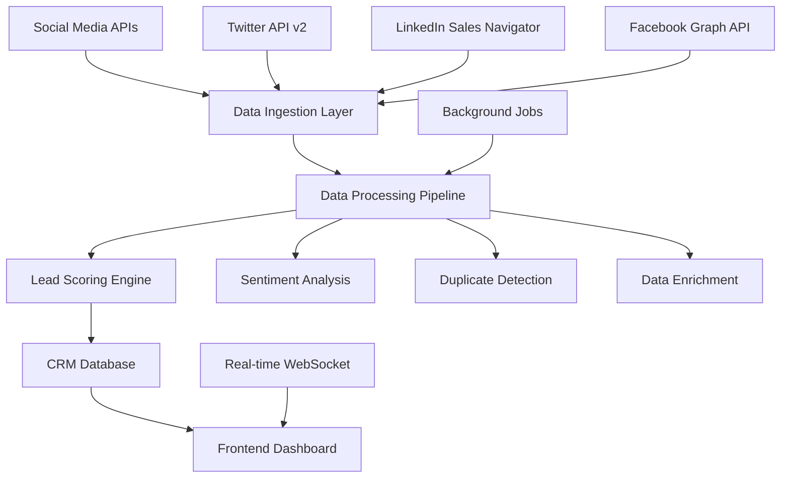

# 🌐 Social Media Integration - Complete Implementation Guide

## 📋 Table of Contents
- [Overview](#-overview)
- [Technical Architecture](#-technical-architecture)
- [API Integrations](#-api-integrations)
- [Lead Discovery System](#-lead-discovery-system)
- [Lead Scoring Algorithm](#-lead-scoring-algorithm)
- [Implementation Steps](#-implementation-steps)
- [Data Processing Pipeline](#-data-processing-pipeline)
- [Frontend Components](#-frontend-components)
- [Use Cases & Features](#-use-cases--features)
- [Security & Compliance](#-security--compliance)

---

## 🎯 Overview

The Social Media Integration system transforms your CRM from a passive contact manager into an active lead discovery engine that monitors social platforms to identify, qualify, and track potential customers in real-time.

### **Core Capabilities**
- **Automated Lead Discovery** - Find prospects based on keywords, industry, and behavior
- **Real-time Social Monitoring** - Track mentions, hashtags, and conversations
- **Intelligent Lead Scoring** - AI-powered qualification based on social signals
- **Profile Enrichment** - Automatically gather comprehensive prospect data
- **Social Engagement Tracking** - Monitor interactions and relationship building

---

## 🏗 Technical Architecture



### **Component Breakdown**

1. **API Integration Layer** - Handles rate limiting, authentication, and data fetching
2. **Data Processing Pipeline** - Cleans, normalizes, and enriches social data
3. **Lead Scoring Engine** - ML-powered qualification system
4. **Real-time Dashboard** - Live monitoring and interaction interface
5. **Automated Workflows** - Background processing and notifications

---

## 🔌 API Integrations

### **1. Twitter API v2 Integration**

#### **Setup & Authentication**
```javascript
// backend/src/services/twitterService.js
const { TwitterApi } = require('twitter-api-v2');

class TwitterService {
  constructor() {
    this.client = new TwitterApi({
      appKey: process.env.TWITTER_API_KEY,
      appSecret: process.env.TWITTER_API_SECRET,
      accessToken: process.env.TWITTER_ACCESS_TOKEN,
      accessSecret: process.env.TWITTER_ACCESS_SECRET,
    });
    this.bearer = new TwitterApi(process.env.TWITTER_BEARER_TOKEN);
  }

  // Real-time tweet monitoring
  async monitorKeywords(keywords) {
    const rules = keywords.map(keyword => ({
      value: `"${keyword}" lang:en -is:retweet`,
      tag: keyword
    }));

    const stream = await this.bearer.v2.updateStreamRules({
      add: rules
    });

    return this.bearer.v2.searchStream({
      'tweet.fields': ['author_id', 'created_at', 'public_metrics', 'context_annotations'],
      'user.fields': ['name', 'username', 'location', 'description', 'public_metrics'],
      'expansions': ['author_id']
    });
  }

  // User profile analysis
  async analyzeProfile(username) {
    const user = await this.bearer.v2.userByUsername(username, {
      'user.fields': [
        'created_at', 'description', 'location', 'name', 
        'public_metrics', 'url', 'verified'
      ]
    });

    const tweets = await this.bearer.v2.userTimeline(user.data.id, {
      max_results: 100,
      'tweet.fields': ['created_at', 'public_metrics', 'context_annotations']
    });

    return {
      profile: user.data,
      recentTweets: tweets.data,
      engagement: this.calculateEngagement(tweets.data),
      interests: this.extractInterests(tweets.data)
    };
  }

  calculateEngagement(tweets) {
    const totalEngagement = tweets.reduce((sum, tweet) => {
      return sum + (tweet.public_metrics?.like_count || 0) + 
                   (tweet.public_metrics?.retweet_count || 0) +
                   (tweet.public_metrics?.reply_count || 0);
    }, 0);

    return {
      averageEngagement: totalEngagement / tweets.length,
      totalTweets: tweets.length,
      engagementRate: totalEngagement / (tweets.length * 100) // Normalized
    };
  }
}
```

#### **Key Features**
- **Keyword Monitoring** - Track industry-specific terms and competitor mentions
- **Hashtag Tracking** - Monitor trending topics and campaigns
- **User Discovery** - Find prospects based on Twitter activity
- **Engagement Analysis** - Measure influence and activity levels
- **Sentiment Analysis** - Understand public opinion and mood

### **2. LinkedIn Sales Navigator API**

#### **Setup & Authentication**
```javascript
// backend/src/services/linkedinService.js
const axios = require('axios');

class LinkedInService {
  constructor() {
    this.baseURL = 'https://api.linkedin.com/v2';
    this.accessToken = process.env.LINKEDIN_ACCESS_TOKEN;
  }

  // Professional profile discovery
  async searchProfiles(criteria) {
    const searchParams = {
      keywords: criteria.keywords,
      currentCompany: criteria.company,
      pastCompany: criteria.pastCompany,
      school: criteria.school,
      profileLanguage: 'en',
      resultType: 'PEOPLE'
    };

    const response = await axios.get(`${this.baseURL}/peopleSearch`, {
      headers: {
        'Authorization': `Bearer ${this.accessToken}`,
        'Content-Type': 'application/json'
      },
      params: searchParams
    });

    return response.data.elements.map(profile => this.enrichProfile(profile));
  }

  // Company information extraction
  async getCompanyInfo(companyId) {
    const response = await axios.get(`${this.baseURL}/companies/${companyId}`, {
      headers: {
        'Authorization': `Bearer ${this.accessToken}`
      },
      params: {
        projection: '(id,name,description,website,industry,employeeCountRange,foundedOn,locations)'
      }
    });

    return {
      id: response.data.id,
      name: response.data.name,
      description: response.data.description,
      website: response.data.website,
      industry: response.data.industry,
      employeeCount: response.data.employeeCountRange,
      founded: response.data.foundedOn,
      locations: response.data.locations
    };
  }

  // Connection tracking
  async trackConnections(profileId) {
    const connections = await axios.get(`${this.baseURL}/people/${profileId}/connections`, {
      headers: {
        'Authorization': `Bearer ${this.accessToken}`
      }
    });

    return {
      connectionCount: connections.data.paging.total,
      mutualConnections: connections.data.elements.filter(c => c.isMutual),
      industryConnections: this.groupByIndustry(connections.data.elements)
    };
  }

  enrichProfile(profile) {
    return {
      id: profile.id,
      name: `${profile.firstName} ${profile.lastName}`,
      headline: profile.headline,
      location: profile.location?.name,
      industry: profile.industry,
      currentPosition: profile.positions?.values?.[0],
      experience: profile.positions?.values || [],
      education: profile.educations?.values || [],
      skills: profile.skills?.values || [],
      connectionDegree: profile.distance?.value,
      profilePicture: profile.pictureInfo?.croppedImage,
      leadScore: this.calculateLeadScore(profile)
    };
  }
}
```

#### **Key Features**
- **Advanced People Search** - Find prospects by role, company, industry
- **Company Intelligence** - Gather comprehensive business information
- **Connection Analysis** - Leverage mutual connections and warm introductions
- **InMail Tracking** - Monitor outreach campaigns and responses
- **Job Change Alerts** - Track career movements for timing opportunities

---

## 🎯 Lead Discovery System

### **Automated Lead Generation**

```javascript
// backend/src/services/leadDiscoveryService.js
class LeadDiscoveryService {
  constructor() {
    this.twitterService = new TwitterService();
    this.linkedinService = new LinkedInService();
    this.scoringEngine = new LeadScoringEngine();
  }

  // Multi-platform lead discovery
  async discoverLeads(criteria) {
    const discoveries = await Promise.all([
      this.discoverFromTwitter(criteria),
      this.discoverFromLinkedIn(criteria),
      this.discoverFromFacebook(criteria)
    ]);

    const allLeads = discoveries.flat();
    const deduplicatedLeads = this.deduplicateLeads(allLeads);
    const scoredLeads = await Promise.all(
      deduplicatedLeads.map(lead => this.scoringEngine.scoreLead(lead))
    );

    return scoredLeads
      .filter(lead => lead.score >= criteria.minimumScore)
      .sort((a, b) => b.score - a.score);
  }

  async discoverFromTwitter(criteria) {
    const keywords = [
      ...criteria.industryKeywords,
      ...criteria.painPointKeywords,
      ...criteria.competitorKeywords
    ];

    const tweetStream = await this.twitterService.monitorKeywords(keywords);
    const leads = [];

    tweetStream.on('data', async (tweet) => {
      const authorAnalysis = await this.twitterService.analyzeProfile(
        tweet.includes.users[0].username
      );

      if (this.qualifiesAsLead(authorAnalysis, criteria)) {
        leads.push({
          platform: 'twitter',
          source: 'keyword_monitoring',
          profile: authorAnalysis.profile,
          engagement: authorAnalysis.engagement,
          triggerTweet: tweet.data,
          discoveryDate: new Date(),
          confidence: this.calculateConfidence(authorAnalysis, criteria)
        });
      }
    });

    return leads;
  }

  async discoverFromLinkedIn(criteria) {
    const searchCriteria = {
      keywords: criteria.jobTitles.join(' OR '),
      company: criteria.targetCompanies,
      industry: criteria.industries,
      location: criteria.locations
    };

    const profiles = await this.linkedinService.searchProfiles(searchCriteria);
    
    return profiles.map(profile => ({
      platform: 'linkedin',
      source: 'profile_search',
      profile: profile,
      discoveryDate: new Date(),
      confidence: this.calculateLinkedInConfidence(profile, criteria)
    }));
  }

  qualifiesAsLead(analysis, criteria) {
    const profile = analysis.profile;
    
    // Check follower count threshold
    if (profile.public_metrics.followers_count < criteria.minFollowers) return false;
    
    // Check engagement rate
    if (analysis.engagement.engagementRate < criteria.minEngagement) return false;
    
    // Check industry relevance
    const industryMatch = criteria.industries.some(industry => 
      profile.description?.toLowerCase().includes(industry.toLowerCase())
    );
    
    // Check geographic location
    const locationMatch = !criteria.locations.length || 
      criteria.locations.some(location => 
        profile.location?.toLowerCase().includes(location.toLowerCase())
      );
    
    return industryMatch && locationMatch;
  }
}
```

### **Real-time Monitoring Dashboard**

```javascript
// Real-time lead discovery with WebSocket
// backend/src/services/realtimeService.js
const WebSocket = require('ws');

class RealtimeService {
  constructor(server) {
    this.wss = new WebSocket.Server({ server });
    this.clients = new Map();
    this.setupWebSocket();
  }

  setupWebSocket() {
    this.wss.on('connection', (ws, req) => {
      const userId = this.authenticateUser(req);
      this.clients.set(userId, ws);

      ws.on('message', (message) => {
        const data = JSON.parse(message);
        this.handleMessage(userId, data);
      });

      ws.on('close', () => {
        this.clients.delete(userId);
      });
    });
  }

  broadcastNewLead(lead) {
    const message = JSON.stringify({
      type: 'NEW_LEAD',
      data: lead,
      timestamp: new Date().toISOString()
    });

    this.clients.forEach((ws, userId) => {
      if (ws.readyState === WebSocket.OPEN) {
        ws.send(message);
      }
    });
  }

  broadcastSocialActivity(activity) {
    const message = JSON.stringify({
      type: 'SOCIAL_ACTIVITY',
      data: activity,
      timestamp: new Date().toISOString()
    });

    this.clients.forEach((ws, userId) => {
      if (ws.readyState === WebSocket.OPEN) {
        ws.send(message);
      }
    });
  }
}
```

---

## 🤖 Lead Scoring Algorithm

### **Multi-factor Scoring System**

```javascript
// backend/src/services/leadScoringEngine.js
class LeadScoringEngine {
  constructor() {
    this.weights = {
      profileCompleteness: 0.15,
      socialEngagement: 0.20,
      industryRelevance: 0.25,
      companySize: 0.15,
      jobTitle: 0.20,
      recentActivity: 0.05
    };
  }

  async scoreLead(lead) {
    const scores = {
      profileCompleteness: this.scoreProfileCompleteness(lead.profile),
      socialEngagement: this.scoreSocialEngagement(lead),
      industryRelevance: this.scoreIndustryRelevance(lead.profile),
      companySize: this.scoreCompanySize(lead.profile),
      jobTitle: this.scoreJobTitle(lead.profile),
      recentActivity: this.scoreRecentActivity(lead)
    };

    const weightedScore = Object.keys(scores).reduce((total, factor) => {
      return total + (scores[factor] * this.weights[factor]);
    }, 0);

    const finalScore = Math.round(weightedScore * 100);

    return {
      ...lead,
      score: finalScore,
      scoreBreakdown: scores,
      tier: this.assignTier(finalScore),
      recommendedActions: this.getRecommendedActions(finalScore, scores)
    };
  }

  scoreProfileCompleteness(profile) {
    let completeness = 0;
    
    if (profile.name) completeness += 20;
    if (profile.headline || profile.description) completeness += 20;
    if (profile.location) completeness += 15;
    if (profile.website || profile.url) completeness += 15;
    if (profile.profilePicture) completeness += 10;
    if (profile.experience?.length > 0) completeness += 20;
    
    return Math.min(completeness, 100) / 100;
  }

  scoreSocialEngagement(lead) {
    if (lead.platform === 'twitter') {
      const metrics = lead.profile.public_metrics;
      const engagement = lead.engagement;
      
      // Calculate engagement rate
      const avgEngagement = engagement.averageEngagement;
      const followerCount = metrics.followers_count;
      const engagementRate = avgEngagement / Math.max(followerCount, 1) * 100;
      
      // Score based on engagement quality
      if (engagementRate > 5) return 1.0;
      if (engagementRate > 2) return 0.8;
      if (engagementRate > 1) return 0.6;
      if (engagementRate > 0.5) return 0.4;
      return 0.2;
    }
    
    if (lead.platform === 'linkedin') {
      // LinkedIn engagement scoring
      const connectionCount = lead.profile.connectionCount || 0;
      
      if (connectionCount > 500) return 1.0;
      if (connectionCount > 200) return 0.8;
      if (connectionCount > 100) return 0.6;
      if (connectionCount > 50) return 0.4;
      return 0.2;
    }
    
    return 0.5; // Default score
  }

  scoreIndustryRelevance(profile) {
    const targetIndustries = [
      'consulting', 'finance', 'fintech', 'banking', 
      'investment', 'advisory', 'management consulting'
    ];
    
    const text = `${profile.description || ''} ${profile.headline || ''} ${profile.industry || ''}`.toLowerCase();
    
    const matches = targetIndustries.filter(industry => 
      text.includes(industry)
    ).length;
    
    return Math.min(matches / targetIndustries.length * 2, 1.0);
  }

  scoreJobTitle(profile) {
    const seniorTitles = [
      'ceo', 'cto', 'cfo', 'founder', 'president', 'vp', 'vice president',
      'director', 'head of', 'chief', 'partner', 'owner'
    ];
    
    const midTitles = [
      'manager', 'senior', 'lead', 'principal', 'consultant'
    ];
    
    const title = (profile.headline || profile.jobTitle || '').toLowerCase();
    
    if (seniorTitles.some(t => title.includes(t))) return 1.0;
    if (midTitles.some(t => title.includes(t))) return 0.7;
    return 0.4;
  }

  assignTier(score) {
    if (score >= 80) return 'HOT';
    if (score >= 60) return 'WARM';
    if (score >= 40) return 'COLD';
    return 'UNQUALIFIED';
  }

  getRecommendedActions(score, breakdown) {
    const actions = [];
    
    if (score >= 80) {
      actions.push('immediate_outreach');
      actions.push('personalized_message');
      actions.push('priority_follow_up');
    } else if (score >= 60) {
      actions.push('targeted_content');
      actions.push('social_engagement');
      actions.push('scheduled_follow_up');
    } else {
      actions.push('nurture_campaign');
      actions.push('content_marketing');
    }
    
    return actions;
  }
}
```

---

## 🔄 Data Processing Pipeline

### **Background Job System**

```javascript
// backend/src/jobs/socialMediaProcessor.js
const Queue = require('bull');
const socialQueue = new Queue('social media processing');

// Process discovered leads
socialQueue.process('process_lead', async (job) => {
  const { leadData, source } = job.data;
  
  try {
    // 1. Data enrichment
    const enrichedLead = await enrichLeadData(leadData);
    
    // 2. Duplicate detection
    const existingLead = await findDuplicateLead(enrichedLead);
    
    if (existingLead) {
      // Update existing lead with new information
      await updateLeadData(existingLead.id, enrichedLead);
    } else {
      // Create new lead
      const newLead = await createLead(enrichedLead);
      
      // 3. Lead scoring
      const scoredLead = await scoreLeadAsync(newLead);
      
      // 4. Auto-assignment based on score and territory
      if (scoredLead.score >= 70) {
        await assignLeadToSalesRep(scoredLead);
        await sendNotification(scoredLead, 'high_priority_lead');
      }
      
      // 5. Add to nurture campaigns
      await addToNurtureCampaign(scoredLead);
    }
    
    return { success: true, leadId: enrichedLead.id };
  } catch (error) {
    console.error('Lead processing failed:', error);
    throw error;
  }
});

// Sentiment analysis job
socialQueue.process('sentiment_analysis', async (job) => {
  const { text, leadId } = job.data;
  
  const sentiment = await analyzeSentiment(text);
  
  await updateLeadSentiment(leadId, sentiment);
  
  return sentiment;
});

// Social activity monitoring
socialQueue.process('monitor_activity', async (job) => {
  const { platform, keywords } = job.data;
  
  const activities = await monitorPlatformActivity(platform, keywords);
  
  for (const activity of activities) {
    // Queue each activity for lead discovery
    await socialQueue.add('process_lead', {
      leadData: activity,
      source: `${platform}_monitoring`
    });
  }
  
  return { processed: activities.length };
});
```

### **Data Enrichment Service**

```javascript
// backend/src/services/dataEnrichmentService.js
class DataEnrichmentService {
  async enrichLeadData(lead) {
    const enrichedData = { ...lead };
    
    // Company enrichment
    if (lead.company) {
      enrichedData.companyInfo = await this.enrichCompanyData(lead.company);
    }
    
    // Email discovery
    if (lead.profile.name && lead.company) {
      enrichedData.possibleEmails = await this.findPossibleEmails(
        lead.profile.name, 
        lead.company
      );
    }
    
    // Industry classification
    enrichedData.industryTags = await this.classifyIndustry(lead.profile);
    
    // Geographic enrichment
    if (lead.profile.location) {
      enrichedData.geography = await this.enrichGeography(lead.profile.location);
    }
    
    // Technology stack (for tech companies)
    if (lead.companyInfo?.website) {
      enrichedData.techStack = await this.detectTechStack(lead.companyInfo.website);
    }
    
    return enrichedData;
  }

  async enrichCompanyData(companyName) {
    try {
      // Use multiple data sources
      const sources = await Promise.allSettled([
        this.getClearbitData(companyName),
        this.getCrunchbaseData(companyName),
        this.getLinkedInCompanyData(companyName)
      ]);
      
      return this.mergeCompanyData(sources.map(s => s.value).filter(Boolean));
    } catch (error) {
      console.error('Company enrichment failed:', error);
      return null;
    }
  }

  async findPossibleEmails(name, company) {
    const patterns = [
      '{first}.{last}@{domain}',
      '{first}@{domain}',
      '{f}.{last}@{domain}',
      '{first}{last}@{domain}'
    ];
    
    const domain = await this.getCompanyDomain(company);
    if (!domain) return [];
    
    const [first, last] = name.toLowerCase().split(' ');
    
    return patterns.map(pattern => 
      pattern
        .replace('{first}', first)
        .replace('{last}', last)
        .replace('{f}', first[0])
        .replace('{domain}', domain)
    );
  }
}
```

---

## 🎨 Frontend Components

### **Social Media Dashboard**

```jsx
// frontend/src/pages/SocialMediaDashboard.tsx
import React, { useState, useEffect } from 'react';
import { Card, Row, Col, Table, Tag, Button, Input, Select } from 'antd';
import { useWebSocket } from '../hooks/useWebSocket';

const SocialMediaDashboard: React.FC = () => {
  const [leads, setLeads] = useState([]);
  const [activities, setActivities] = useState([]);
  const [filters, setFilters] = useState({
    platform: 'all',
    tier: 'all',
    dateRange: '7d'
  });

  // Real-time updates via WebSocket
  const { lastMessage, sendMessage } = useWebSocket('/ws/social');

  useEffect(() => {
    if (lastMessage?.type === 'NEW_LEAD') {
      setLeads(prev => [lastMessage.data, ...prev]);
      // Show notification
      notification.success({
        message: 'New Lead Discovered!',
        description: `${lastMessage.data.profile.name} - Score: ${lastMessage.data.score}`
      });
    }
  }, [lastMessage]);

  const columns = [
    {
      title: 'Profile',
      key: 'profile',
      render: (_, lead) => (
        <div className="flex items-center space-x-3">
          
          <div>
            <div className="font-medium">{lead.profile.name}</div>
            <div className="text-sm text-gray-500">{lead.profile.headline}</div>
          </div>
        </div>
      )
    },
    {
      title: 'Platform',
      dataIndex: 'platform',
      key: 'platform',
      render: (platform) => (
        <Tag color={platform === 'linkedin' ? 'blue' : 'cyan'}>
          {platform.toUpperCase()}
        </Tag>
      )
    },
    {
      title: 'Score',
      dataIndex: 'score',
      key: 'score',
      render: (score, lead) => (
        <div className="flex items-center space-x-2">
          <div className={`w-3 h-3 rounded-full ${
            lead.tier === 'HOT' ? 'bg-red-500' :
            lead.tier === 'WARM' ? 'bg-yellow-500' : 'bg-blue-500'
          }`} />
          <span className="font-medium">{score}</span>
          <Tag color={
            lead.tier === 'HOT' ? 'red' :
            lead.tier === 'WARM' ? 'orange' : 'blue'
          }>
            {lead.tier}
          </Tag>
        </div>
      )
    },
    {
      title: 'Discovery Source',
      dataIndex: 'source',
      key: 'source'
    },
    {
      title: 'Actions',
      key: 'actions',
      render: (_, lead) => (
        <div className="space-x-2">
          <Button 
            type="primary" 
            size="small"
            onClick={() => handleConvert(lead)}
          >
            Convert to Contact
          </Button>
          <Button 
            size="small"
            onClick={() => handleViewProfile(lead)}
          >
            View Profile
          </Button>
        </div>
      )
    }
  ];

  return (
    <div className="p-6">
      <Row gutter={[24, 24]}>
        {/* Real-time Metrics */}
        <Col span={24}>
          <Row gutter={[16, 16]}>
            <Col span={6}>
              <Card>
                <div className="text-2xl font-bold text-blue-600">
                  {leads.filter(l => l.tier === 'HOT').length}
                </div>
                <div className="text-gray-600">Hot Leads Today</div>
              </Card>
            </Col>
            <Col span={6}>
              <Card>
                <div className="text-2xl font-bold text-green-600">
                  {activities.length}
                </div>
                <div className="text-gray-600">Social Activities</div>
              </Card>
            </Col>
            <Col span={6}>
              <Card>
                <div className="text-2xl font-bold text-purple-600">
                  {Math.round(leads.reduce((sum, l) => sum + l.score, 0) / leads.length) || 0}
                </div>
                <div className="text-gray-600">Average Score</div>
              </Card>
            </Col>
            <Col span={6}>
              <Card>
                <div className="text-2xl font-bold text-orange-600">
                  {leads.filter(l => l.discoveryDate >= new Date(Date.now() - 24*60*60*1000)).length}
                </div>
                <div className="text-gray-600">New Discoveries</div>
              </Card>
            </Col>
          </Row>
        </Col>

        {/* Filters */}
        <Col span={24}>
          <Card title="Filters & Search">
            <Row gutter={[16, 16]}>
              <Col span={8}>
                <Select
                  placeholder="Select Platform"
                  style={{ width: '100%' }}
                  value={filters.platform}
                  onChange={(value) => setFilters({...filters, platform: value})}
                >
                  <Select.Option value="all">All Platforms</Select.Option>
                  <Select.Option value="linkedin">LinkedIn</Select.Option>
                  <Select.Option value="twitter">Twitter</Select.Option>
                </Select>
              </Col>
              <Col span={8}>
                <Select
                  placeholder="Select Tier"
                  style={{ width: '100%' }}
                  value={filters.tier}
                  onChange={(value) => setFilters({...filters, tier: value})}
                >
                  <Select.Option value="all">All Tiers</Select.Option>
                  <Select.Option value="HOT">Hot Leads</Select.Option>
                  <Select.Option value="WARM">Warm Leads</Select.Option>
                  <Select.Option value="COLD">Cold Leads</Select.Option>
                </Select>
              </Col>
              <Col span={8}>
                <Input
                  placeholder="Search by name, company..."
                  onChange={(e) => handleSearch(e.target.value)}
                />
              </Col>
            </Row>
          </Card>
        </Col>

        {/* Leads Table */}
        <Col span={24}>
          <Card title="Discovered Leads" extra={
            <Button type="primary" onClick={handleBulkActions}>
              Bulk Actions
            </Button>
          }>
            <Table
              columns={columns}
              dataSource={filteredLeads}
              pagination={{
                pageSize: 20,
                showSizeChanger: true,
                showQuickJumper: true
              }}
              rowSelection={{
                type: 'checkbox',
                onChange: handleSelectionChange
              }}
            />
          </Card>
        </Col>
      </Row>
    </div>
  );
};
```

### **Real-time Activity Feed**

```jsx
// frontend/src/components/SocialActivityFeed.tsx
import React, { useState, useEffect } from 'react';
import { Timeline, Card, Avatar, Tag, Button } from 'antd';

const SocialActivityFeed: React.FC = () => {
  const [activities, setActivities] = useState([]);

  const activityItems = activities.map(activity => ({
    children: (
      <Card size="small" className="mb-4">
        <div className="flex items-start space-x-3">
          <Avatar src={activity.user.avatar} size="large" />
          <div className="flex-1">
            <div className="flex items-center space-x-2 mb-2">
              <span className="font-medium">{activity.user.name}</span>
              <Tag color={activity.platform === 'linkedin' ? 'blue' : 'cyan'}>
                {activity.platform}
              </Tag>
              <span className="text-xs text-gray-500">
                {activity.timestamp}
              </span>
            </div>
            <div className="mb-2">{activity.content}</div>
            {activity.leadScore && (
              <div className="flex items-center space-x-2">
                <span className="text-xs">Lead Score:</span>
                <Tag color={activity.leadScore > 70 ? 'red' : 'orange'}>
                  {activity.leadScore}
                </Tag>
                <Button size="small" type="link">
                  Convert to Lead
                </Button>
              </div>
            )}
          </div>
        </div>
      </Card>
    ),
    color: activity.type === 'mention' ? 'red' : 'blue'
  }));

  return (
    <div className="h-96 overflow-y-auto">
      <Timeline items={activityItems} />
    </div>
  );
};
```

---

## 🎯 Use Cases & Features

### **1. Automated Lead Discovery**
- **Industry Monitoring** - Track mentions of your target industries
- **Competitor Analysis** - Monitor competitor mentions and engage with their audience
- **Event-based Discovery** - Find prospects discussing industry events or challenges
- **Job Change Alerts** - Identify decision-makers who recently changed positions

### **2. Social Selling Enablement**
- **Warm Introduction Paths** - Find mutual connections for introductions
- **Conversation Starters** - Identify recent posts or achievements for engagement
- **Content Amplification** - Track who's engaging with your content for follow-up
- **Relationship Mapping** - Visualize professional networks and influence

### **3. Account-Based Marketing (ABM)**
- **Target Account Monitoring** - Track all social activity from target companies
- **Stakeholder Identification** - Find all decision-makers within target accounts
- **Buying Signal Detection** - Monitor for purchase intent signals
- **Competitive Intelligence** - Track target accounts' vendor discussions

### **4. Sales Intelligence**
- **Real-time Notifications** - Get alerts when prospects show buying signals
- **Engagement Scoring** - Prioritize outreach based on social engagement levels
- **Conversation History** - Track all social interactions with prospects
- **Team Collaboration** - Share social insights across sales team

---

## 🔒 Security & Compliance

### **Data Privacy Measures**

```javascript
// backend/src/middleware/dataPrivacy.js
class DataPrivacyMiddleware {
  // GDPR compliance
  async ensureGDPRCompliance(socialData) {
    // Only collect necessary data
    const allowedFields = [
      'name', 'headline', 'company', 'location', 
      'publicMetrics', 'professionalInfo'
    ];
    
    return this.filterFields(socialData, allowedFields);
  }

  // Data retention policies
  async enforceRetentionPolicy() {
    const retentionPeriod = 365; // days
    const cutoffDate = new Date(Date.now() - retentionPeriod * 24 * 60 * 60 * 1000);
    
    // Auto-delete old social data
    await SocialProfile.destroy({
      where: {
        createdAt: { [Op.lt]: cutoffDate },
        consentStatus: 'withdrawn'
      }
    });
  }

  // Consent management
  async trackConsent(leadId, consentType, granted) {
    await ConsentRecord.create({
      leadId,
      consentType,
      granted,
      timestamp: new Date(),
      source: 'social_discovery'
    });
  }
}
```

### **Rate Limiting & API Management**

```javascript
// backend/src/services/rateLimitService.js
class RateLimitService {
  constructor() {
    this.limits = {
      twitter: { requests: 300, window: 15 * 60 * 1000 }, // 300 per 15 min
      linkedin: { requests: 100, window: 60 * 60 * 1000 }  // 100 per hour
    };
  }

  async enforceLimit(platform, userId) {
    const key = `rate_limit:${platform}:${userId}`;
    const current = await redis.get(key);
    
    if (current && current >= this.limits[platform].requests) {
      throw new Error(`Rate limit exceeded for ${platform}`);
    }
    
    await redis.multi()
      .incr(key)
      .expire(key, this.limits[platform].window / 1000)
      .exec();
  }

  async getQueuePosition(platform) {
    const queueLength = await socialQueue.getWaiting().length;
    return Math.ceil(queueLength / this.limits[platform].requests);
  }
}
```

---

## 📊 Analytics & ROI Tracking

### **Social Media ROI Dashboard**

```javascript
// Generate social media ROI reports
class SocialROIAnalytics {
  async generateROIReport(dateRange) {
    const socialLeads = await Lead.findAll({
      where: {
        source: { [Op.like]: '%social%' },
        createdAt: { [Op.between]: dateRange }
      },
      include: [Opportunity, Activity]
    });

    const metrics = {
      totalLeadsDiscovered: socialLeads.length,
      qualifiedLeads: socialLeads.filter(l => l.score >= 60).length,
      convertedOpportunities: socialLeads.filter(l => l.opportunities.length > 0).length,
      totalPipelineValue: socialLeads.reduce((sum, lead) => {
        return sum + lead.opportunities.reduce((opSum, opp) => opSum + opp.value, 0);
      }, 0),
      averageLeadScore: socialLeads.reduce((sum, l) => sum + l.score, 0) / socialLeads.length,
      platformBreakdown: this.groupByPlatform(socialLeads),
      timeToConversion: this.calculateConversionTime(socialLeads)
    };

    return metrics;
  }
}
```

This comprehensive social media integration system will transform your CRM into a powerful lead generation engine, automatically discovering and qualifying prospects while providing your sales team with rich social context for more effective outreach.

The system is designed to be scalable, compliant, and ROI-focused, ensuring that every social interaction contributes to your business growth objectives.